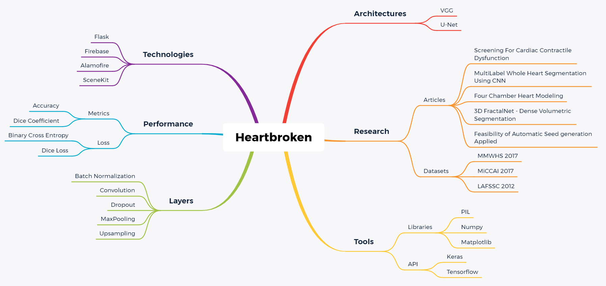

# Project Heartbroken #

### A project that will help medicine students to become better doctors ###

## Project Purpose & Scope ##

An application intended for medicine students which allows uploading an image, analyzing and visualizing relevant information about it.

The application can detect various malformations and can help the student by teaching him to recognize them

## Technologies ##

For this project we used Python as a server-side programming language and we integrated it with Swift on client-side

<The following are the frameworks and libraries used in developing the application:>

* Front-end
  - [Firebase](https://firebase.google.com)
  - [Almonfire](https://github.com/Alamofire/Alamofire)

* Back-end
  - [Flask](https://flask.palletsprojects.com/en/1.1.x/)
  
* AI
  - [Keras 1.1.2](https://keras.io/)
  - [Tensorflow 2.3.1](https://www.tensorflow.org/)
  - [Skimage 0.18](https://scikit-image.org/docs/dev/api/skimage.html)
  - [PIL 2.2.2](https://pillow.readthedocs.io/en/stable/)
  - [Numpy 1.18.5](https://numpy.org/)
  - [Matplotlib](https://matplotlib.org/)
  - [Nibalbel 3.2.1](https://nipy.org/nibabel/)
  - [Pip 20.3.1](https://pypi.org/project/pip/)
 
Below you can find an user-friendly mind-map with the structure of the project 

 
